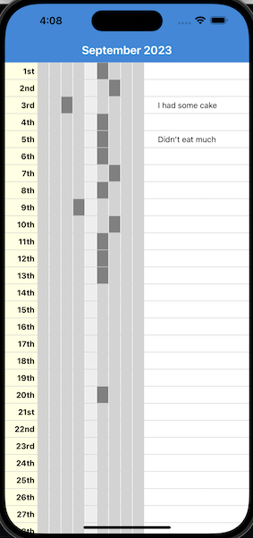

# noyoyo

A weight loss journaling app with a focus on low tech, in person sharing
with your community of weight loss peers.

The expected scenario is for a group of people from your community want to lose
weight and form an group that meets up regularly to share their progress and
support each other. The presumed issue this app specifically targets is that
people are not comfortable sharing their weight with others. The proposed
solution is that:

 1. the group works on a monthly cycle.
 1. each member only targets a single pound of weight loss per month.
 1. each member enters their weight into the app at the beginning of the month
    and every day thereafter.
 1. the app only shows the weight loss or gain since the beginning of the month,
    allowing the member to physically show the monthly weight loss or gain
    trend.

The app also allows the member to enter a comment for each day, which can be
used to record any informantion that might be useful to the group, such as
diet, exercise, or other notes.

## Data

We don't store anything off device. All data is stored in SQLite on the device.
This way there should be no concerns about privacy.

A possible future enhancement would be to use the devices Health data to get
the weight data, but that would require a lot more permissions and I'm not sure 
how comfortable people would be with that.

## Possible future enhancement ideas

 1. Automatically pick up weight for Health data or smart scale.

 ## Dev

 I'm using react-native to get a feel for it. Previously have created a flutter
 app so want something to compare it to.

 ## App in action

    